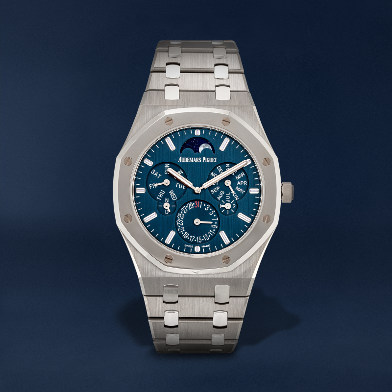

# Untitled page

#### Lets create some sort of to do list

* Create repository on github
* Synchronize created repository with a gitbook
* Make some changes via gitbook

Start app in Dev mode

```
yarn start
```







language of the sphere (e.g. en, de, it)



```javascript
{
    // Response
    [{
        "id": 9595,
        "button_type": "custom",
        "color": "#FFFFFF",
        "title": null,
        "enabled": false,
        "icon_url": null,
        "border_color": "",
        "border_width": "0",
        "button_size": "small",
        "use_border": false,
        "position": 100,
        "button_font": {
            "id": 5769,
            "font_size": "14px",
            "font_weight": "400",
            "letter_spacing": "0",
            "line_height": "1.71",
            "font": {
                "id": 8211,
                "file_url": "https://cdn-pre-dev.spheresdev.co.uk/pubtool-images/nn9qglkhakh74118ycl7d5ylfgz6",
                "name": "Montserrat-Regular",
                "filename": "Montserrat-Regular.ttf"
            },
            "font_id": 8211,
            "button_id": 9595,
            "color": "#FFFFFF",
            "assignment": "custom"
        }
    },
    {
        "id": 9596,
        "button_type": "rakuten",
        "color": "#FFFFFF",
        "title": null,
        "enabled": false,
        "icon_url": null,
        "border_color": "",
        "border_width": "0",
        "button_size": "small",
        "use_border": false,
        "position": 100,
        "button_font": {
            "id": 5770,
            "font_size": "14px",
            "font_weight": "400",
            "letter_spacing": "0",
            "line_height": "1.71",
            "font": {
                "id": 8211,
                "file_url": "https://cdn-pre-dev.spheresdev.co.uk/pubtool-images/nn9qglkhakh74118ycl7d5ylfgz6",
                "name": "Montserrat-Regular",
                "filename": "Montserrat-Regular.ttf"
            },
            "font_id": 8211,
            "button_id": 9596,
            "color": "#FFFFFF",
            "assignment": "rakuten"
        }
    },
    {
        "id": 9593,
        "button_type": "amazon",
        "color": "#000000",
        "title": null,
        "enabled": false,
        "icon_url": "https://cdn-pre-dev.spheresdev.co.uk/webapp-v2/assets/img/icons/amazon.svg",
        "border_color": "",
        "border_width": "0",
        "button_size": "small",
        "use_border": false,
        "position": 100,
        "button_font": null
    },
    {
        "id": 9594,
        "button_type": "ebay",
        "color": "#FFFFFF",
        "title": null,
        "enabled": false,
        "icon_url": "https://cdn-pre-dev.spheresdev.co.uk/webapp-v2/assets/img/icons/ebay.svg",
        "border_color": "",
        "border_width": "0",
        "button_size": "small",
        "use_border": false,
        "position": 100,
        "button_font": null
    }]
}
```



<figure><figcaption></figcaption></figure>

[](http://www.youtube.com/watch?v=YOUTUBE_VIDEO_ID_HERE)
